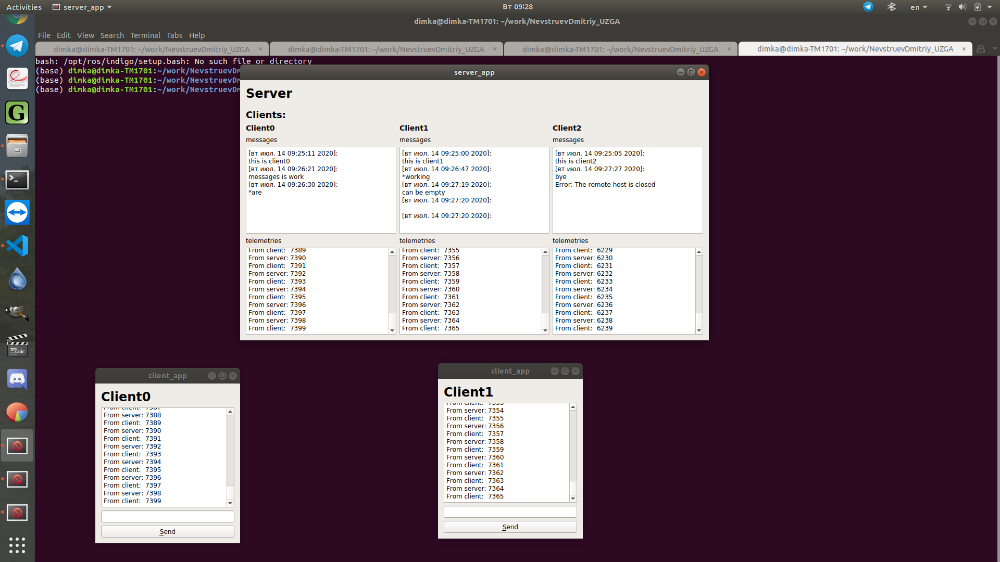

Это тестовое задание на должность "инжинер-программист" выполненное Невструевым Дмитрием.



## Что сделано:
Написаны приложения server_app и client_app. Для передачи ифнформации между ними использую QTcpSocket. Реализованна возможность подключения "много клиентов - один
сервер". Для каждого клиента на стороне сервера отображается информационные окна "messages" и "telemetry". Каждому клиенту при подключении выдаётся имя на время сессии, в формате "ClientX".

Для контроля целостности сообщений дополнительно пересылаю md5 хеш, и сравниваю его с хешом полученного сообщения. В случае несовпадения, вывожу ошибку в "messages", но не считаю её критической и не прерываю процесс.

Для генерации сообщений написан класс Telemetry, функция run() которого вызывается в отдельном потоке на сервере и клиенте. В конструктор класса передаётся параметры генерации сообщений - начальное значение счётчика, шаг инкриментации, время отправки первого сообщения, периуд отправки последующих.

Клиент отправляет серверу сообщение с инкриментирующимся счётчиком (нечётные значения) раз в 100ms. Это отмечается клиентом и сервером в текстовом поле "telemetries" в формате "From client: X".

По команде пользователя клиент отпарвляет серверу сообщение (введённое в тестовой строке) и дату. Это фиксируется сервером в тектовом поле "messages".

Сервер генерирует сообщение с инкриментирующимся счётчиком (чётные значения) раз в 100ms, с задержкой первого сообщения 50ms. Это отмечается клиентом и сервером в текстовом поле "telemetries" в формате "From server: X". В условии сказано что генерировать сообщения сервера надо раз в 50ms. Мне показалось, что смысл чётных и нечётных инкрементирующихся счётчиков в том, что бы сообщения в текстовом поле шли последовательно. В любом случае, что бы изменить периуд генерации сообщений достаточно изменить одну строчку в коде (sourses/server.cpp::38)

На экране отображается последние несоклько сообщений (в указанном выше формате), предыдущие можно посомтреть скролом вверх (был вариант скрыть скрол, и настроить высоту текстового поля на ровно 10 сообщений, но я не стал это делать из-за потери в этом случае данных - они обновляются достаточно быстро).

В случае потери связи выводится сообщение об ошибке (как у сервера так и у клиента).

В хедерах написаны документирующие коментарии, поясняющие комментарии поместил в файлах исходного кода.

## Компиляция и запуск
Что бы собрать проект:
```sh
cmake -H. -B_build
cmake --build _build
```

Что бы запустить сервер:
```sh
./_build/server_app
```

Серверу возможно передать порт:
```sh
./_build/server_app 2323
```

Что бы запустить клиента:
```sh
./_build/client_app
```

Клиенту возможна передача аргументов - хост и порт для подключения:
```sh
./_build/client_app 0.0.0.0 2323
```

## Обзор
В папке "include" находятся хедеры, в папке "source" лежат исходники. "application" содержит приложения для сервера и клиента.

Использую из фреймворков: qt, CMake

## Список литературы

За основу взяты тутрриалы:

http://qt-doc.ru/realizacia-servera-s-pomoschu-klassa-qtcpserver.html

http://qt-doc.ru/realizacia-klienta-s-pomoschu-klassa-qtcpsocket.html

И статьи:

https://habr.com/ru/post/181838/
